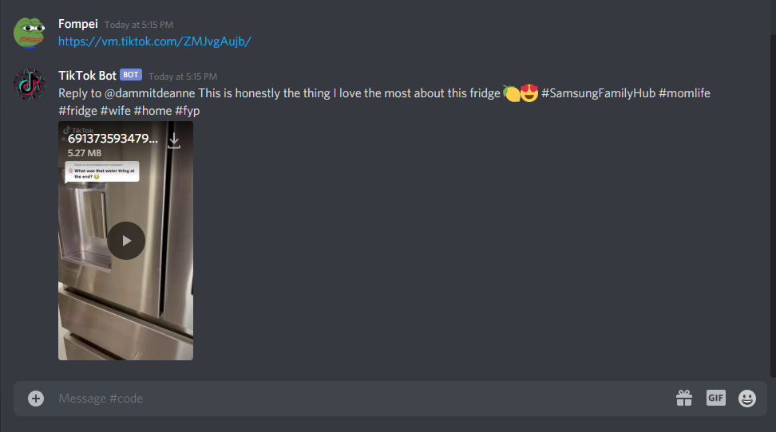

# TikTok Video Poster

## Problem to Solve

Sharing Tiktok videos on Discord just gives the link to share.  
The users of the Discord server have to manually click the link to be sent to a browser to view the video.  
This discord bot recognizes tiktok video links and uploads the video for easier viewing.  

### Experience without Bot

### Experience with Bot

## Run Locally

Add Discord bot token into .env_sample  
Change .env_sample to .env  
`npm i`  
`npm run start`

## Install

`docker build -t tiktok .`  
`docker run tiktok`  

## Todos

- [x] put into ec2 w/ docker
- [ ] look at upload limits for bot
- [x] reply to user with username of poster with link, description & tags
- [x] fix issues with windows & linux related backslash & forward slash
- [ ] convert to typescript
- [x] add images to readme 
- [ ] fix promise reject catch errors with dead tiktok link https://vm.tiktok.com/ZMJ7XTrRx/
- [ ] check other repos like this
- [x] change method of retrieving video, due to security concerns ex. `https://vm.tiktok.com/ZMJ7XTrRx/; ls -la`

## References

discord.js  
tiktok-search  
